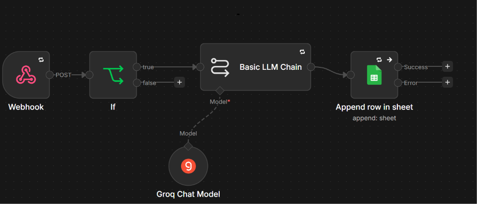
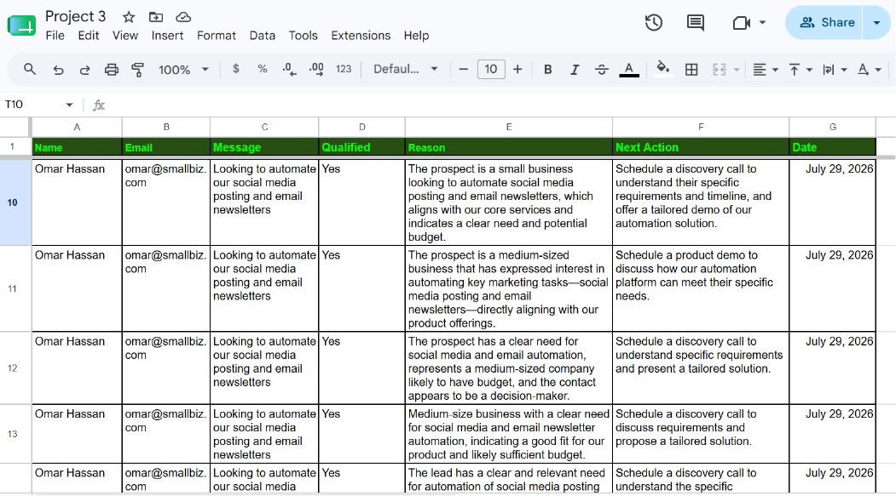

# 🔗 Project 3: Webhook AI Process

An n8n automation that receives external data via a webhook, processes it through a Groq-powered AI model, and automatically logs the AI's response into Google Sheets.

---

## 📌 What This Project Does

This workflow shows how an external system (or app) can trigger an AI process automatically:
1. A webhook receives incoming data via a POST request
2. The data is passed to a Groq-powered AI chat model for processing
3. The AI's response is automatically appended as a new row in a Google Sheet

This demonstrates real-time, event-driven automation instead of manual or scheduled triggers.

---

## ⚙️ How It Works (Workflow)

---

## 🛠️ Tech Stack

| Tool | Purpose |
|------|---------|
| **n8n** | Workflow automation |
| **Webhook** | Receives external data (event-driven trigger) |
| **Groq API (openai/gpt-oss-20b)** | AI processing of incoming data |
| **Google Sheets** | Logs AI responses automatically |

---

## 📷 Screenshots

*Full n8n workflow canvas*

*AI responses logged as new rows in Google Sheets*

---

## 🎯 What I Learned

- How to use a webhook to capture data from external sources in real time
- How to route incoming data through an AI chat model for processing
- How to automatically log AI-generated results into Google Sheets

---

## 👤 Author

Built by Abdullah as part of a self-directed AI Automation learning program.
